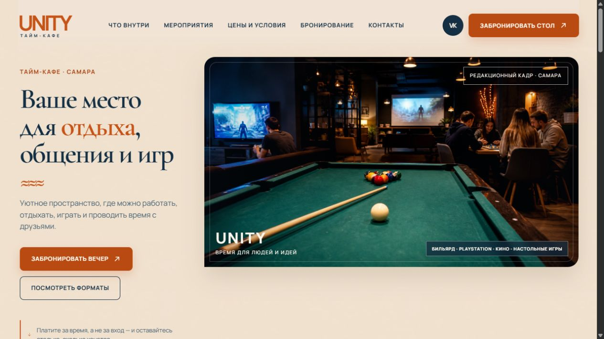

# UNITY

Демонстрационный сайт тайм-кафе в Самаре: игровые форматы, события, отзывы, контакты и сценарий бронирования. Вторая итерация проекта.



[Открыть демо](https://kaigo.space/site/unity/)

## Реализация

- React, TypeScript, Vite и Framer Motion.
- Адаптивная навигация, галерея форматов, переключение событий и отзывов.
- Секция контактов, карта и FAQ.
- Демо-форма с локальной валидацией: отправка данных на backend не подключена.

## Локальный запуск

```bash
npm ci
npm run dev
```

Адрес и порт выводит Vite в терминале. Для сборки и unit-тестов:

```bash
npm run build
npm run test:run
```

История реализации, визуальные решения и результаты предыдущих проверок находятся в `docs/`. Скриншот снят с публичного демо 9 сентября 2026 года; это проверка внешнего вида, не повторный прогон всех тестов.

## Материалы

Портфолио-демо, не заявление об официальном сотрудничестве с заведением. Реальные фотографии и AI-assisted редакционные изображения явно различаются. Права на бренд и документальные фотографии не передаются вместе с кодом.
